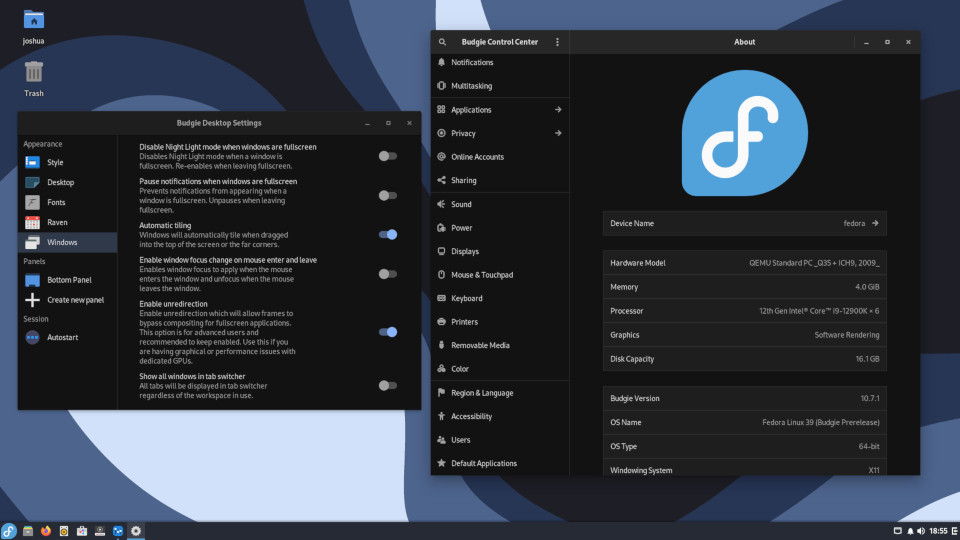

This document provides guidance on writing documentation for Buddies of Budgie. This is not intended to be an all-encompassing document, however it will strive to provide links to any extra resources to make your documentation writing as easy as possible.

## What Should Be Documented?

Buddies of Budgie documentation is intended to cover the following:

- Day-to-day usage of Budgie Desktop, with useful information to new and existing users alike. This can be everything from keybinds to how to install Budgie Desktop on various operating systems. It is not intended to replace documentation for those specific operating systems or any applications those operating systems / curated experiences provide, but useful guidance on navigating around various "core" Budgie Desktop functionality and features.
- Developing Budgie Desktop or "on top of" the desktop with our panel and Raven widget APIs.
- Information about the organization, how it operates on a daily basis, and how one can get involved in the organization (not even necessarily coding!)

## Before Getting Started

If you would like to write some documentation but aren't sure where to start, our recommendation would be to take a look at our [issue tracker](https://github.com/BuddiesOfBudgie/docs/issues) which may have requested documentation.

:::info
All of our [documentation](https://github.com/BuddiesOfBudgie/docs), including the site itself, is open source, meaning you can take a look at how it all works under the hood!
:::

If you have an idea of some documentation to write, we suggest taking a look at the issue tracker linked above or see if someone else had a similar idea by taking a look at our [pull requests](https://github.com/BuddiesOfBudgie/docs/pulls).

Writing documentation requires _some_ technical knowledge, but it isn't anything we believe you can't learn if you haven't already! In some cases, issues can just be solved with some copy / paste and editing.

The process of writing and submitting documentation requires that you "fork" our GitHub repository linked above. Forking is effectively creating your own copy of all of our source code (e.g. the website) and docs (like this one!). To do all of this, you will need an account with GitHub, the collaboration platform we use for issue tracking, source code management, feature requests, and more.

:::note
GitHub accounts are free and you can create one just by visiting their [sign up](https://github.com/signup) page.
:::

Have an account? Great! Now it's time to do that forking we talked about. Just click [here](https://github.com/BuddiesOfBudgie/docs/fork) and you should immediately be greeted with a page with pre-filled details. Make sure the owner is you, then click "Create fork".

You will need to now "clone" your fork to your computer. There is a bunch of different ways to do that, from the command-line to various graphical programs. Given that fact, we would just recommend you check out [GitHub's documentation](https://docs.github.com/en/repositories/creating-and-managing-repositories/cloning-a-repository).

Of course, testing out your changes will require some technical knowledge, but our [README](https://github.com/BuddiesOfBudgie/docs) should help walk you through that. You can read it in your fork too!

:::danger Need help?
You can reach out to us on our [Matrix Space](https://matrix.to/#/#buddies-of-budgie:matrix.org) for guidance if you run into issues.
:::

## The Writing

Documentation is written in either [GitHub-flavored Markdown (GFM)](https://github.github.com/gfm/) or [MDX](https://mdxjs.com). Chances are, you will be writing your documentation in GFM, so we will stick to that for documentation. For really fancy docs, be sure to take a look at Docusaurus' [Markdown Features](https://docusaurus.io/docs/markdown-features).

[Docusaurus](https://docusaurus.io), the tooling we use to provide this nifty documentation center, has [documentation on creating a document](https://docusaurus.io/docs/create-doc). The basics are:

1. Figure out where the doc goes. Is it something related to development workflow? Put it in `doc/developer/workflow`. Related to the end-user? Probably somewhere in `docs/user`. If you aren't sure, that's fine, we can always move the file later or invent a new category.
2. Create a file in the respective folder with the file extension `.md`. For example, "Hello World" should be all lowercased with spaces replaced with `-`, so `hello-world.md`.
3. Create the header of the file. There is a lot of ["front matter" options](https://docusaurus.io/docs/api/plugins/@docusaurus/plugin-content-docs#markdown-front-matter), but just stick with the basics of a `title` and `description` for now per the linked documentation for Docusaurus.

Once you do that, the recommendation is to run Docusaurus on your local machine following our documentation linked in the README of the repository. This will provide you a live preview of the documentation and how your doc will look in the live environment for the rest of the world to see.

After that, just start writing!

## Submitting a Pull Request

Submitting a pull request can be done through our [GitHub repository](https://github.com/BuddiesOfBudgie/docs). GitHub has [excellent documentation](https://docs.github.com/en/pull-requests/collaborating-with-pull-requests/proposing-changes-to-your-work-with-pull-requests/creating-a-pull-request) that can walk you through this process. Since you will likely be working on a "fork" of the repository, it is recommended to follow GitHub's documentation on [creating a pull request from a fork](https://docs.github.com/en/pull-requests/collaborating-with-pull-requests/proposing-changes-to-your-work-with-pull-requests/creating-a-pull-request-from-a-fork).

## Recommendations

### Assets

Docusaurus supports [adding assets](https://docusaurus.io/docs/markdown-features/assets), such as images, to a document. Please keep assets in an `assets/document-name-here` folder relative to the Markdown file.

:::tip Example
We would expect assets for this document, located at `docs/developer/documentation/writing-documentation.md` to reside in `docs/developer/documentation/assets/writing-documentation`. We have an example below for reference (and testing!)
:::

Transparency should be used sparingly as our documentation center supports both light and dark theme. Using images that look good against a light background may make them unreadable on a dark one, and vise-versa. You can use [Themed Images](https://docusaurus.io/docs/markdown-features/assets#themed-images) in MDX, but consider if that is necessary first!

Images should be compressed without noticable artifacting, preferably in JPG.
